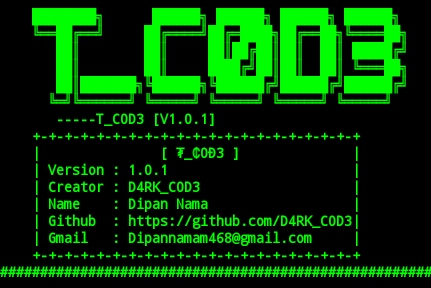

<h1 align="center">T_C0D3</h1>

<p align="center"> This script helps to the web devolopers to auto creare project directories for their upcoming projects.</p>

<p align="center">
   
</p>

# Installation

```
$ apt-get update -y
```

```
$ apt-get upgrade -y
```

```
$ apt-get install git -y
```

```
$ apt-get install python -y
```

```
$ apt-get install python3 -y
```

```
git clone https://github.com/D4RK-C0D3/T_C0D3.git
```

```
cd T_C0D3
```

### Run code

```
python T_C0D3.py
```
# About
   This `script` helps to the `web devolopers` to auto `create project directories` for their upcoming projects.
